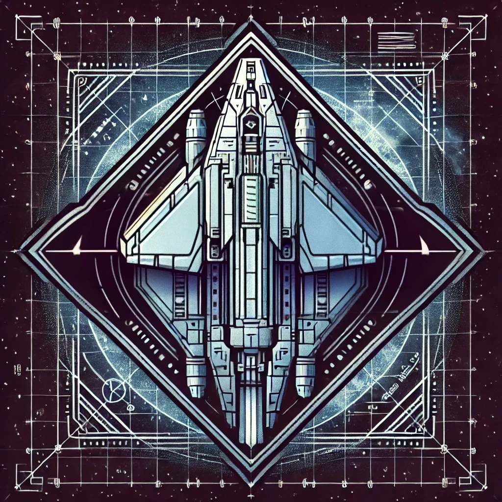

# **Starship Architect**



## **Overview**

**Starship Architect** is a ship-building, construction, and management simulation game set in a futuristic, sci-fi universe. As a player, you are tasked with designing, building, and managing a starship that evolves from a small vessel into a massive generational ship capable of sustaining an entire civilization. The game blends strategy, resource management, and storytelling, offering a unique experience for fans of the sci-fi genre.

### **Genre**

- City-building Game
- Construction and Management Simulation
- Strategy Game

### **Target Audience**

- Sci-fi Enthusiasts
- Strategy and Simulation Fans
- Players who enjoy deep management and building mechanics

## **Gameplay Features**

### **Core Mechanics**

1. **Resource Management**:

   - **Building Materials and Money**: Use resources and currency to construct ship facilities and upgrades.
   - **Energy**: Generate power from reactors and other advanced technologies to sustain ship systems.
   - **Crew**: Manage population growth, employment, and morale to ensure a thriving ship environment.
   - **Research Points**: Earn research points to unlock new technologies and enhance ship capabilities.

2. **Starship Building**:

   - Design and expand your ship using a variety of building tiles such as habitats, commercial zones, and production facilities.
   - Utilize advanced technologies to build essential ship components like engines, life support systems, healthcare facilities, and more.

3. **NPC (Non-Player Character) Management**:

   - Oversee the crew, each with unique roles like engineers, medical staff, and security personnel.
   - Manage NPC behaviors and interactions to keep the ship operational and safe.

4. **Progression System**:

   - Advance through different ship classes, from a small Shuttlecraft-class to a colossal Universe-class starship.
   - Unlock new facilities, technologies, and challenges as you progress.

5. **Dynamic Events and Challenges**:
   - Face a variety of challenges such as resource scarcity, cosmic storms, alien encounters, and internal conflicts.
   - Respond to dynamic events that test your strategic planning and decision-making skills.

### **Secondary Mechanics**

- **Desirability and Reputation**: Manage factors like cleanliness, health, and security to improve the ship's desirability and attract more crew members.
- **Ship Reputation**: Navigate the political landscape, making choices that affect your ship's standing as a diplomat or warmonger.

## **Development Goals and Roadmap**

### **Phase 1: Core Development**

- Establish the core game loop and basic mechanics.
- Implement the fundamental resource management system.
- Develop initial ship-building features and NPC management.
- Create a basic user interface with retro sci-fi terminal aesthetics.

### **Phase 2: Expansion and Polish**

- Introduce advanced ship modules and technologies.
- Implement dynamic events and complex challenge scenarios.
- Enhance graphics with simple pixel art and animations.
- Refine NPC behaviors and interactions for greater depth.

### **Phase 3: Late Game Content and Optimization**

- Develop the late-game content with massive ships and advanced facilities.
- Optimize game performance for different platforms.
- Conduct extensive testing and polish user experience.

## **Inspirations and Aesthetics**

- **Visual Style**: A blend of sleek, high-tech designs with gritty, dystopian elements reminiscent of sci-fi classics like "Mass Effect," "Blade Runner," and "Ghost in the Shell."
- **Audio Design**: A diverse soundscape ranging from synth-heavy tones to orchestral scores, reflecting different settings and moods within the game.

## **How to Contribute**

We welcome contributions from the community! Whether you're a developer, designer, or sci-fi enthusiast, there are many ways to get involved:

1. **Fork and Clone** the repository.
2. **Check the Issues** tab for tasks and bugs to work on.
3. **Submit Pull Requests** with your contributions.
4. **Join Discussions** and share your ideas and feedback!

## **Installation and Setup**

To set up the development environment:

1. **Clone the Repository**:
   ```bash
   git clone <repository-url>
   cd starship-architect
   ```
